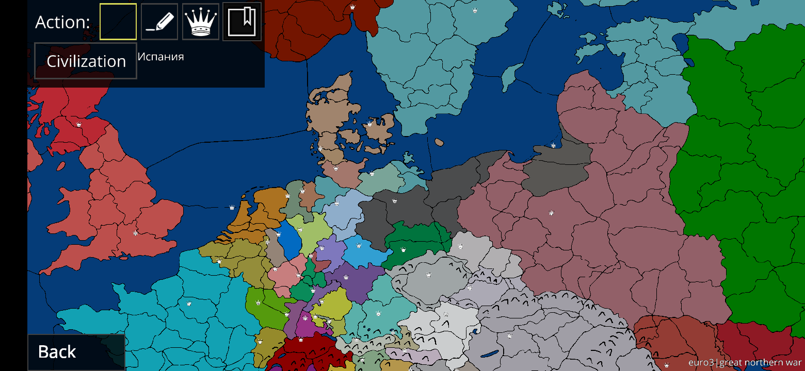

# Awesome Cold Path

> Curated list of quality tools, maps and useful links for Cold Path game

 *Cold Path* is turn-based multiplayer strategy game developed by *jalhund*
 
 ## Contents
 * [Guides](#Guides)
 * [Tools](#Tools)
 * [Maps](#Maps)
 * [Plugins](#Plugins) 
 * [Links](#Links)
 
## Guides

*Detailed useful guides*

* [Global servers](https://book.denismakhortov.com/server/summary) - creating and customization server
* [Map Editor](https://book.denismakhortov.com/guides/map-editor) - creating custom map

## Tools

* [Cold Path Server Sources](https://github.com/jalhund/cold-path-server) - sources of global server
* [Cold Path Map Editor](https://github.com/jalhund/cold-path-map-editor) - sources of Map Editor. You can download ready to use apk files in Releases section
* [Cold Path Map Updater](https://github.com/jalhund/ColdPathMapUpdater) - simple tool for updating game map from <15 game version to >=15 
* Cold Path Adjacency Validator (*tools* folder) - simple tool for updating game map from <15 game version to >=15

## Maps

## Plugins

* [Operator](./plugins/operator.lua) - type '/op <nickname or part of nickname>' to add player to list of admins. Author: *Eternal Lumiere#6960*

## Links

* [Official Discord](https://discord.gg/CrCXVkV) - Official Discord server
